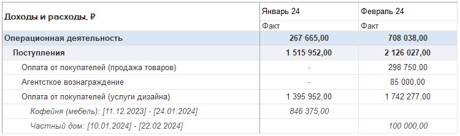
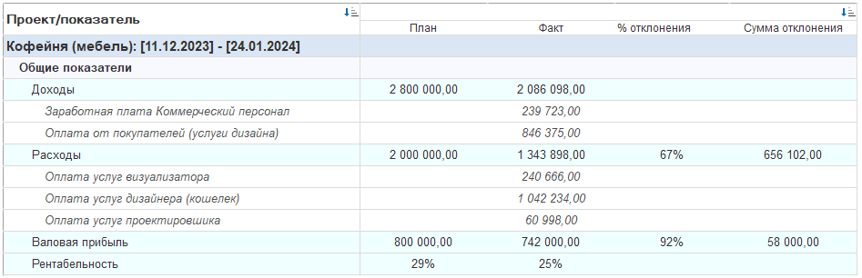

## **Как клиент использует базовый (упрощенный) проектный учет в системе P&L для 1С:Предприятие**

В системе P&L для 1С:Предприятие есть мощный функционал учета по проектам. Это не просто дополнительная опция, а действительно неотъемлемая часть всей системы для управленческого учета на предприятиях. 

Проектный блок позволяет гибко и детально формировать любые необходимые финансовые отчеты, смотря на деятельность компании сквозь призму отдельных проектов. Представьте, сколько разных задач решается, когда вы можете видеть финансы не только по компании в целом или по подразделениям, но и по каждой конкретной инициативе, сделке или направлению работы!

Модуль предлагает три уровня детализации проектного учета: упрощенный, расширенный и профессиональный. Сегодня я хочу рассказать вам реальный кейс, как один из наших клиентов эффективно использует именно базовый, упрощенный вариант. Это отличный пример, когда не нужна сверхсложная настройка, но результат получается очень весомым.

### **Задача клиента:**

Клиент подходит к проектам очень практично – для них каждый проект – это, по сути, **сделка**. Их основная цель – четкое финансовое управление на уровне каждой такой сделки-проекта. Им критически важно:

1. **Заранее знать рентабельность:** Понимать плановую доходность *каждой* сделки еще до ее полного завершения.

2. **Контролировать денежные потоки:** Видеть в деталях, как именно деньги *приходят* по сделке (поступления от заказчика) и как они *расходуются* (платежи поставщикам, исполнителям и т.д.).

3. **Оценивать результат:** Рассчитывать *фактическую* рентабельность по завершении этапов или всей сделки.

4. **Управлять задолженностью:** Четко видеть долги – как свои (перед кем-то по сделке), так и дебиторку (кто должен им).

5. **Отслеживать статусы:** Понимать, на какой стадии находится каждая сделка-проект (в работе, завершен, просрочен платеж и т.д.).

6. **Получать детальную отчетность:** Формировать различные отчеты именно по сделкам-проектам для анализа и принятия решений.

Именно наш модуль P&L стал для них инструментом, который закрыл *все* эти вопросы в рамках упрощенного учета.

### **Как это работает на практике (упрощенный учет):**

#### **Включение и Настройка.**

Первым делом администратор системы включает функционал проектного учета в настройках P&L.

[image:./keys-ucheta-bazovogo-varianta.png::Вкладка \"Настройки\", блок \"Проекты\":0,0,100,100::square,35.1082,14.8305,22.3794,8.0508,,top-left&square,35.025,28.6017,22.5458,6.3559,,top-left:1202px:472px]

#### **Создание проекта (сделки).**

Теперь клиент создает в системе отдельный **Проект** для каждой своей значимой сделки. При создании указываются ключевые параметры:

-  Название проекта (часто соответствует названию сделки/контракта).

-  Сроки действия (Дата начала и окончания проекта).

-  Ответственная организация (юридическое лицо из их структуры).

-  Контрагент (заказчик или ключевой партнер по сделке).

-  Договор (основной документ сделки).

-  **Плановые показатели:** Плановый доход (ожидаемая выручка) и Плановый расход (ожидаемые затраты). Система сразу рассчитывает **плановую рентабельность** на основе этих цифр – это дает первичное понимание выгодности сделки.

   

   [image:./keys-ucheta-bazovogo-varianta-3.png::Список проектов находится на вкладке «Проекты»:0,0,100,100::square,89.4073,0,10.5927,19.5122,,top-left&square,0,32.6829,17.6545,21.4634,,top-left:793px:205px]

   {width=544px height=529px}

#### **Ежедневная работа бухгалтера/фин. менеджера.**

После создания проекта, его нужно **указывать в документах**. Это ключевой шаг для сбора данных! Бухгалтер (или другой специалист) при проведении *любых* финансовых документов, связанных с этой сделкой, **обязательно заполняет поле "Проект"**.

-  **Какие документы?** Абсолютно все денежные и бухгалтерские документы, относящиеся к сделке:

   -  Поступления денег от заказчика (Платежные поручения входящие, Кассовые чеки).

   -  Платежи поставщикам/исполнителям (Платежные поручения исходящие, Расходные кассовые ордера).

   -  Реализация товаров/услуг (Накладные, Акта выполненных работ/оказанных услуг).

   -  И другие документы, отражающие доходы/расходы по сделке.

-  **Где указывать?** Проект указывается в **дополнительных реквизитах P&L**, которые легко доступны во всех необходимых документах. Это занимает секунду, но зато все данные автоматически "привязываются" к нужному проекту-сделке.

[image:./keys-ucheta-bazovogo-varianta-4.png::Во всех документах появился блок \"Реквизиты P&L\":0,0,100,100::square,50.8459,71.0744,40.3384,15.7025,,top-left:1123px:242px]

{width=523px height=150px}

#### **Мониторинг и анализ в режиме реального времени.**

**Список проектов:** Пользователь заходит в общий список проектов. Выбирая конкретный проект (сделку), он мгновенно видит всю собранную информацию в одном месте:

-  **Общие сведения** (параметры, плановые показатели).

-  **Фактические платежи и поступления** – полная детализация движения денег по этой сделке.

-  **Маржинальный доход (прибыль/убыток)** – расчет фактического финансового результата по сделке на текущий момент.

-  **Статусы и задолженности** – видно, есть ли просрочки платежей (их или им), текущее состояние проекта.

   {width=747px height=377px}

   [image:./keys-ucheta-bazovogo-varianta-9.png::В списке набора колонок система позволяет по-разному проанализировать список проектов:0,0,100,100::square,14.4137,20.7101,17.9153,21.8935,,top-left:1228px:169px]

#### **Планирование платежей (Платежный календарь)**

Клиент не только фиксирует факт, но и может планировать будущие денежные потоки по сделке:

-  Можно вносить плановые поступления и платежи **прямо в карточке проекта**, на вкладке "Платежный календарь".

-  Либо работать с **общим платежным календарем** всей компании, но обязательно указывая при планировании соответствующий проект.

-  **Отслеживание исполнения:** Система позволяет легко видеть в календаре, какие плановые платежи/поступления по сделке уже исполнены, какие ожидаются, а какие – **просрочены**. Это дает мощный инструмент контроля финансовых обязательств и ожиданий по каждому проекту.

   [image:./keys-ucheta-bazovogo-varianta-10.png::Вкладка платежный календарь в самом проекте:0,0,100,100::square,36.0599,0,23.0415,23.0769,,top-left:868px:208px]

#### **Мощная Отчетность (Сила P&L в Действии)**

Вот где модуль P&L раскрывается полностью! Благодаря тому, что все операции помечены проектом, система позволяет строить невероятно полезные отчеты:

-  **План-Факт анализ:** Сравнение плановых доходов/расходов с фактическими по каждой сделке. Видно, где уложились в бюджет, а где произошло отклонение.

-  **Отчет по Платежному календарю с детализацией по проектам:** Показывает движение денег не только по статьям, но и в разрезе *каждой сделки*. Видно запланированные, исполненные и просроченные суммы по каждому проекту.

-  **Отчет DDS (Движение Денежных Средств) с детализацией по проектам:** Анализ реальных денежных потоков компании, но с возможностью "развернуть" и увидеть, какой вклад в общий поток внесла каждая конкретная сделка-проект. То же самое с отчетами по Доходам и Расходам (APIO - Анализ Прибылей и Убытков).

-  **Анализ Доходов/Расходов по проектам:** Детализированные отчеты о том, из чего именно складывались доходы и расходы по каждой сделке.

-  **Различные варианты представления:** Система позволяет строить как вертикальные (иерархические), так и горизонтальные (сводные, кросс-таблицы) отчеты, анализируя как деньги, так и объемы (накладные) в разрезе проектов.

   {width=750px height=223px}

{width=947px height=306px}

### **Итого**

Используя *упрощенный* проектный учет в P&L, наш клиент получил четкую, прозрачную и **управляемую картину по каждой своей сделке**. Они видят плановую и фактическую рентабельность, контролируют каждый рубль прихода и расхода, оперативно реагируют на просрочки и изменения статусов. Формирование необходимых отчетов занимает минуты, а не часы ручной сборки данных. Это дало им инструмент для принятия более обоснованных решений по текущим сделкам и планированию будущих. И все это – без сложных настроек профессионального уровня, на базовом функционале проектного учета P&L, который идеально лег на их потребность видеть финансы в разрезе сделок.