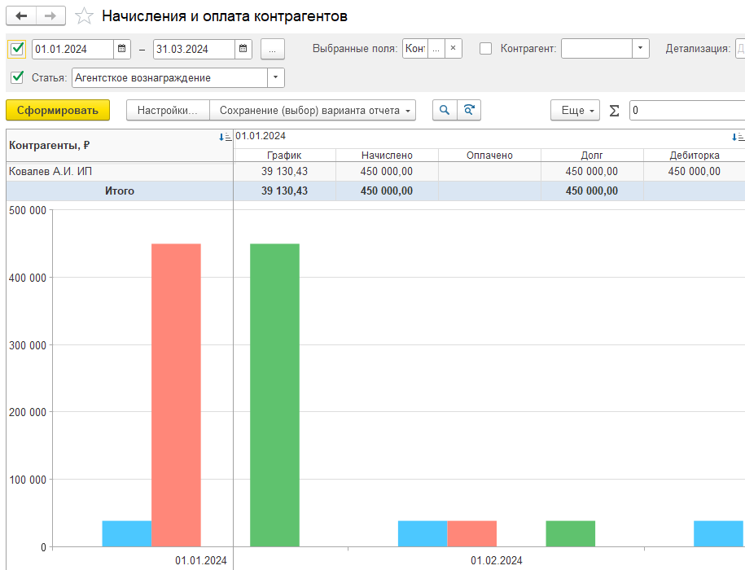

**Цель:** показать клиенту, как модуль автоматизирует рутинные процессы, повышает контроль над договорами, денежными потоками и управленческой отчетностью, начиная с правильного заполнения договоров.

### **Начало - Установка контекста и ценности**

 Мы детально разберем, как наш модуль кардинально упростит вашу работу с договорами, планированием доходов/расходов и контролем платежей. 

Учет по договорам больше подойдет тем, кто:

-   Оказывает услуги и ежемесячно выставляет акт и счет клиентам. Наш блок позволит автоматизировать создание акта и счета. Позволит проконтролировать создание всех актов и счетов и их оплаты.

-  Для тех, кому необходимо заполнить плановые доходы и расходы по проекту. Контролировать выполнение плана по договору.

   Например, очень полезно будет школьным учреждениям, которым необходимо распределить общую сумму договора на месяцы для распределения признанной выручки в отчете ОПиУ.

-  Ведет договора в рамках этапов. В рамках этапов они должны контролировать сроки оплаты и исполнения договоров.

Главное – все начинается с **правильного заполнения договора в системе**. Это ваша отправная точка для всей автоматизации. Давайте пройдем по шагам, как это работает и что вы получаете на выходе.

### **Договор - Основа всего** 

Начнем с вкладки 'Договоры'. Это не просто справочник, а 'мозг' ваших финансовых процессов в модуле. Нам необходимо перейти на вкладку **«Сведения по PnL»**

{width=1714px height=550px}

#### **Что критично заполнить ВСЕГДА:**

-  **Период действия:** Без этого система не сможет автоматически фильтровать действующие договоры в общем нашем списке по договорам.

-  **Сумма договора:** Позволяет контролировать общий лимит и прогнозировать доходы/расходы.

-  **Категория договора (Абонентское, Проектное, Продажи и т.д.):** Ваша собственная классификация для удобной группировки и анализа. *Пример: Разделите договоры на "IT-поддержка", "Разработка ПО", "Консалтинг".*

-  **Статус (Черновик, Активен, Завершен и т.д.):** Открытый справочник, который вы можете настроить под свои нужды для быстрого отбора.

#### **«Состав договора» - Сердце автоматизации:**

**Почему заполнять 'Состав' ВАЖНО?** Потому что именно ЭТОТ шаг запускает ВСЮ автоматизацию дальше:

-  Без него **не заработает** автоматическое создание графиков актов.

-  Без него **не будет** планового распределения доходов/расходов для управленческой отчетности (P&L).

-  Без него **нельзя** массово формировать акты/счета в 'Инструментах'.

Здесь вы детализируете, *за что именно* платите или получаете деньги. Добавьте номенклатуру (услугу/товар), статью ДДС/ДДР (важнейшую для P&L!), количество, цену. *Пример: Услуга "Техническая поддержка", Статья "Доходы от абонентского обслуживания", Количество=12 мес., Цена=10 000 руб. - Сумма посчитается автоматически.*

**Зачем это нужно?** Именно из этого состава система будет автоматически формировать графики выставления актов/счетов и плановое распределение доходов/расходов для управленческого учета и P&L отчетов.

### Автоматизация Графиков (Из Состава Договора -> График)

Вкладка график полезен тем, кто оказывает услуги и ежемесячно выставляет акт и счет клиентам. Наш блок позволит автоматизировать создание акта и счета. Позволит проконтролировать создание всех актов и счетов и их оплаты.

Как только Состав договора заполнен, включается автоматизация. Кликните правой кнопкой мыши на строке в составе и выберите «**Заполнить график**».

**Система предложит проект графика:** На основе периода договора, суммы и количества (например, месяцев). Вы можете настроить:

-  Стартовую дату (если начало не с 1-го числа).

-  День выставления в каждом периоде (например, всегда 25-е число).

-  Периодичность (Ежемесячно, Ежеквартально).

-  **Важно:** Проверьте суммы в первом/последнем месяцах, если период неполный – их часто нужно скорректировать вручную. *Пример: Договор начал действовать с 28.04. Первый акт за апрель будет на 4 дня (28-30) - сумму нужно поправить.*

-  **Содержание акта:** Можно задать шаблон, который система будет использовать (например, "Услуги по договору №XXX за \{Месяц} \{Год}"). *(Уточните у нас текущий статус функции подстановки месяца в содержание – мы ее активно дорабатываем!)*

-  **Результат:** У вас появляется четкий план, *когда* и *за что* нужно выставить акты/счета контрагентам или ожидать их от поставщиков. Этот план – основа для следующего шага.

:::tip Интересная функция!

В расшифровке можно указать полное описание номенклатуры. Это позволит строке корректно отображаться в документах при создании печатных форм. 

Можно в расшифровке указать один из параметров: **\[ТекущийМесяц\],  \[ПрошлыйМесяц\]** ИЛИ **\[СледующийМесяц\]**

При выборе параметра для графика параметр автоматически преобразуется в дату. Формат даты можно настроить в шапке инструмента.

:::

{width=1474px height=601px}

### Контроль доходов и расходов 

На основе "Состава договора" система может автоматически распределить плановые доходы и расходы по месяцам действия договора

Они позволяют: 

-  Контролировать план-фактный учет (с помощью инструмента отчета по взаиморасчетам)

-  Вести учет по рентабельности 

-  Сформировать ОПиУ в рамках учета по договорам (указав метод «Договоры»)

Кликните правой кнопкой мыши на строке в составе и выберите «Заполнить доходы» и «Заполнить расходы».

### **Инструменты Формирования Актов/Счетов (Из Плана -> Факт)**

**"План есть – пора действовать!"** Зайдите в 'Инструменты' на вкладке 'Договоры' и выберите 'Формирование актов и счетов'.

-  **Выберите период** (например, Июнь 2024). Система автоматически найдет ВСЕ договоры с покупателями, у которых запланировано выставление актов в этом периоде.

-  **Можно наложить отборы:** По конкретной организации, статье ДДС для большей точности.

-  **Просмотр и корректировка:** Перед созданием вы видите список со всеми деталями (контрагент, договор, сумма, расшифровка). При необходимости можно что-то поправить прямо здесь (например, выбрать другую номенклатуру для конкретного акта).

-  **"Создать" - Волшебная кнопка:** Нажатие создаст все необходимые документы реализации (акты/накладные) и счета на оплату в 1С. *Пример: За июнь запланировано 15 актов. Один клик – и все 15 документов созданы в системе!*

-  **Контроль:** Этот инструмент – ключевой для бухгалтерии/менеджеров по продажам, чтобы видеть, *все ли запланированные акты выставлены* в срок. Ничего не потеряется!

{width=1268px height=202px}

###  **Отчетность**

Вся информация, заложенная в договорах и прошедшая через графики, доходы и расходы, становится основой для вашей управленческой отчетности P&L (Прибыли и Убытки):

 

#### **Отчеты модуля:**

-  **Взаиморасчеты:** Мощный отчет, показывающий динамику по договорам: плановые и фактические доходы (накладные), поступления/списания денег, дебиторскую/кредиторскую задолженность. Группировка по периодам (месяцам). *Пример: Видите, сколько должно было поступить за май, сколько поступило фактически и какой остался долг по каждому контрагенту.*

{width=1273px height=807px}

**Начисление и оплата контрагентов:** Отчет, построенный строго на данных графиков, показывает исполнение плана выставления актов/счетов и оплат по ним.

{width=915px height=700px}

-  **Диаграмма ганта:** Визуализация периода действия договоров, их статуса, суммы и степени исполнения (оплачено/не оплачено).

-  **Связь с P&L:** Указанные в составе договора статьи ДДС напрямую попадают в ваши P&L отчеты. Автоматическое распределение гарантирует, что доходы и расходы отразятся в правильные периоды.

### **Итого!**

 Начиная с тщательного заполнения договора и его состава, вы запускаете цепочку автоматизации:

1. **План:** Автоматическое создание графиков актов и платежей.

2. **Действие:** Массовое формирование документов (акты, счета) в пару кликов.

3. **Контроль:** Централизованное управление денежными потоками и исполнением обязательств.

4. **Аналитика:** Мощные отчеты по взаиморасчетам и исполнению договоров, лежащие в основе точного P&L.

### **Что это дает бизнесу?**

-  **Экономия времени:** Убирает дни ручной работы по выставлению актов, формированию счетов и сверке платежей.

-  **Повышение точности:** Минимизация ошибок при переносе данных.

-  **Усиление контроля:** Все договоры, планы платежей и факты – в одном месте. Ничего не теряется.

-  **Актуальная аналитика:** Быстрое получение отчетов по задолженностям, исполнению договоров и формированию P&L.

-  **Прогнозирование:** Четкое понимание будущих денежных потоков на основе планов.